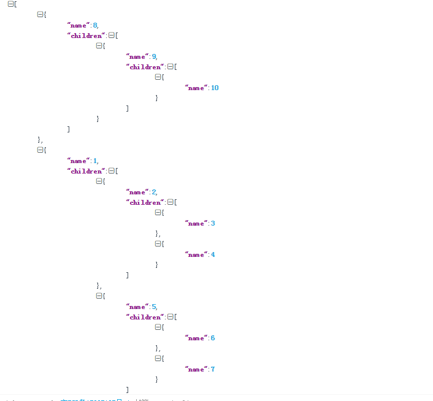

# Scripts

> 一些自己用的脚本

# 头像生成算法

# excel\_to\_json 说明
### xlsx文件格式如下
<table>
    <tr>
        <td>1列</td>
        <td>2列</td>
        <td>3列</td>
    </tr>
    <tr>
        <td>1</td>
        <td>2</td>
        <td>3</td>
    </tr>
    <tr>
        <td>1</td>
        <td>2</td>
        <td>4</td>
    </tr>
    <tr>
        <td>1</td>
        <td>5</td>
        <td>6</td>
    </tr>
    <tr>
        <td>1</td>
        <td>5</td>
        <td>7</td>
    </tr>
    <tr>
        <td>8</td>
        <td>9</td>
        <td>10</td>
    </tr>
</table>

### 目标格式

# runner.go 说明
> 通过通道监控程序的执行时间. 应用哎corn, 或者定时任务的云环境.

# pool.go说明
> 模拟连接池, 使用mutex(互斥锁进行数据同步), resources是实现了Close接口的类型, 列入dbConnnect, PoolNew作为开放的工厂函数,   
> Acquire在资源中获取一个资源去使用, 如果不存在资源, 那么就用工厂函数factory进行创建. Release是放资源, 把资源放回到resources,  
> Close关闭池子, Release, Close使用额互斥锁, 保证数据closed的同步, 不能某个goroutine关闭池, 
> 而其他的goroutine还在向resources写入数据

# golang实现验证码

